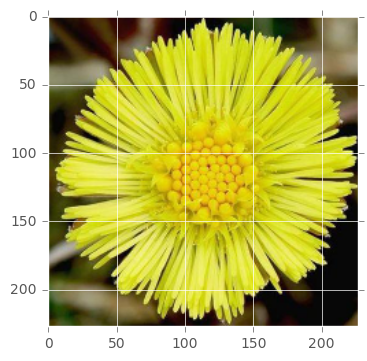

# Fine-tuning trained CNN to classify flower images  

* Jupyter notebook on
[fine-tuning-cnn.ipynb](https://github.com/amasky/fine-tuning-cnn/blob/master/fine-tuning-cnn.ipynb)

## Examples  

* Inference of fine-tuned CNN   

```
# 1| Colls' Foot  |  99.998%
# 2| Daisy        |   0.002%
# 3| Sunflower    |   0.000%
# 4| Dandelion    |   0.000%
# 5| Buttercup    |   0.000%
```

## Dependencies
Python (2 or 3), Chainer, jupyter, matplotlib, scipy, opencv, tqdm  
